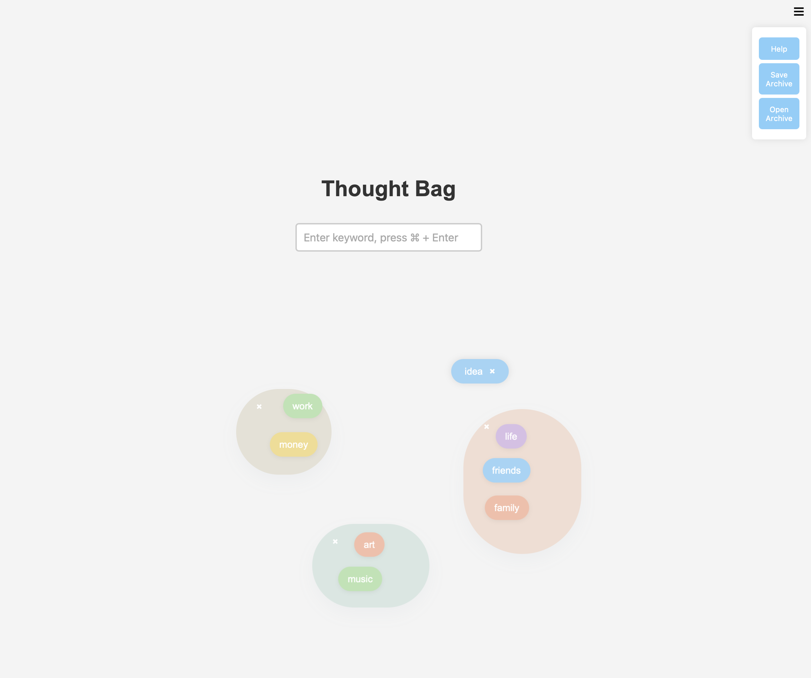

# Thought Bag

Thought Bag is a small, loose thinking tool for catching words and ideas that come up during casual conversation.

Instead of turning everything into a rigid note or clean diagram, it lets you drop ideas as soft floating bubbles, move them around, gather them into groups, and come back later to see what was there.

## Screenshot



## Why I Made This

Sometimes good ideas do not arrive as neat bullet points.

They show up in conversation, in half-finished thoughts, in random associations, or in things you say before you fully know what you mean. I wanted a tiny tool that feels lighter than a document and less formal than a mind map.

Thought Bag is meant for that in-between space: not polished notes, not task management, just a place to hold thoughts for a while.

## What It Can Do

- Add keyword bubbles from text input
- Drag bubbles around freely
- Draw around multiple bubbles to group them into a larger bubble
- Ungroup a large bubble back into small bubbles
- Change colors manually
- Save and reopen your current state with `Save Archive` / `Open Archive`
- Restore grouped states as groups, not just individual bubbles

## Basic Use

1. Type a word or short phrase into the input field.
2. Press `Cmd + Enter` to add it as a bubble.
3. Drag bubbles around to make space or place related ideas near each other.
4. Draw a loose shape around several bubbles to turn them into a group.
5. Click the `×` on a group bubble to break it back into small bubbles.
6. Click a bubble to change its color if you want to reorganize visually.
7. Use `Save Archive` to download the current state, and `Open Archive` to restore it later.

## Run Locally

This project is a very small Express app.

### Requirements

- Node.js
- npm

### Start

```bash
npm install
npm start
```

Then open:

```text
http://localhost:3000
```

## Good For

Thought Bag works well for:

- collecting words that come up during conversation
- capturing early-stage ideas before they become structured notes
- clustering related themes in a soft, visual way
- personal reflection, brainstorming, and small creative sessions

It is especially useful when you want to notice patterns without forcing everything into categories too early.

## Notes / Limitations

- This is a lightweight local tool, not a full note-taking system.
- It is designed for short words and small idea fragments, not long-form writing.
- Grouping keeps items in a flat internal structure for simplicity.
- Archives are saved as JSON files and restored locally through the browser.
- There is no voice input feature anymore; the app now focuses on simple keyboard-based capture.

## Current Name

The current name of the project is `Thought Bag`.

Earlier versions used the name `Thought Recorder`, but that is no longer the active title.
